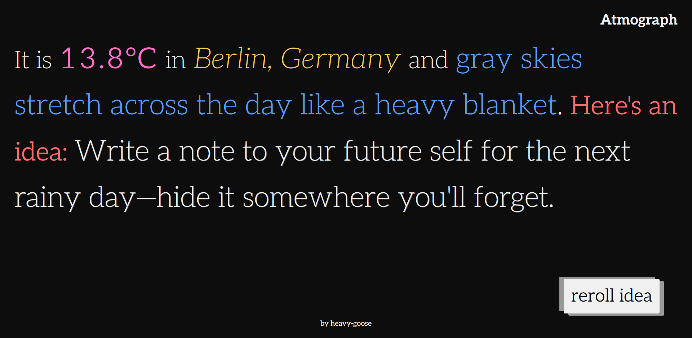

# Atmograph

**Atmograph** is a typography-focused, weather-inspired idea generator. It fetches your local weather and responds with a poetic description of the conditions and a personalized suggestion of what to do with your day. It’s less about forecasting and more about feeling. If the sky can shift your mood, maybe this little app can too.


Think of it as a minimalist mood companion—one that listens to the sky and answers in sentences.

---

## 🌤 What It Does

- Gets your **current geolocation**
- Fetches real-time **weather data** via [Visual Crossing](https://www.visualcrossing.com/)
- Reverse-geocodes your **city name** using [OpenCage](https://opencagedata.com/)
- Displays:
  - Current temperature
  - Location
  - A poetic weather description
  - A curated activity idea tailored to the conditions

All presented in clean, large, serif typography over a dark background—with zero images, icons, or distractions.


*Above: Atmograph with a overcast-based mood suggestion*
---

## 🛠 How to Use

1. Create a `public/secure.json` file (⚠️ this file is **.gitignored** for security):

```json
{
  "visualCrossingApiKey": "YOUR_VISUAL_CROSSING_API_KEY",
  "openCageApiKey": "YOUR_OPENCAGE_API_KEY"
}
```

> ⚠️ **Important Note**:  
> API keys are not provided in this repo for security reasons.  
> While storing them in a JSON file is **not secure**, it adds a minor layer of obfuscation and is sufficient for this purely client-side portfolio project. For production, you'd use a server-side proxy or environment variables.

2. Install dependencies & run (if using bundler like Webpack/Vite):

```bash
npm install
npm run dev
```

## 📁 Project Structure

```
/public
  secure.json          ← your API keys (not committed). This file is to be created by you.
  secure.example.json  ← example structure for secure.json
  activities.json      ← curated suggestions per condition
  descriptions.json    ← poetic descriptions of each condition
/src
  index.js             ← core logic
  styles.css           ← dark-mode typography styling
  reset.css            ← my css reset
  
```

---

## 🚀 Features To Be Improved / Added

### 🔧 Technical
- Replace naive `getActivity()` with a **non-repeating shuffle** queue
- Extract services (`WeatherService`, `LocationService`) for modularity
- Add loading state / error UI for failed geolocation or API fetches
- Normalize condition strings more robustly (e.g. trim, lowercase, aliasing)
- Consider replacing JSON key storage with a more secure pattern

### 🎨 UX / Aesthetic
- Add dark/light mode toggle
- Animate transitions between weather ideas
- Dynamically change highlight colors based on weather tone
- Responsive layout improvements for ultra-small screens